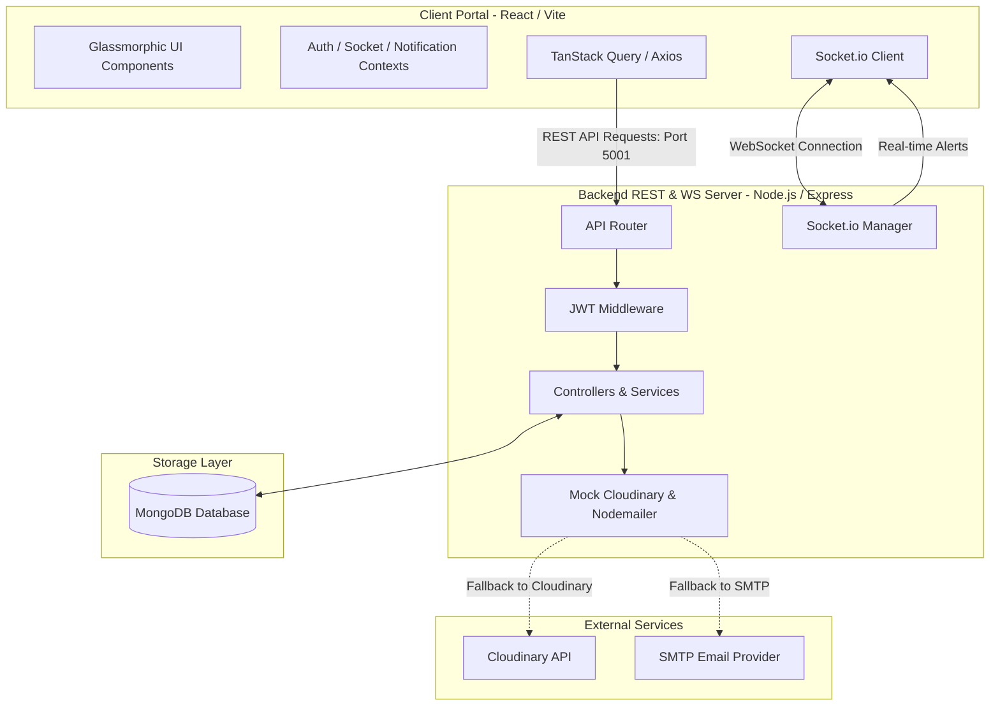
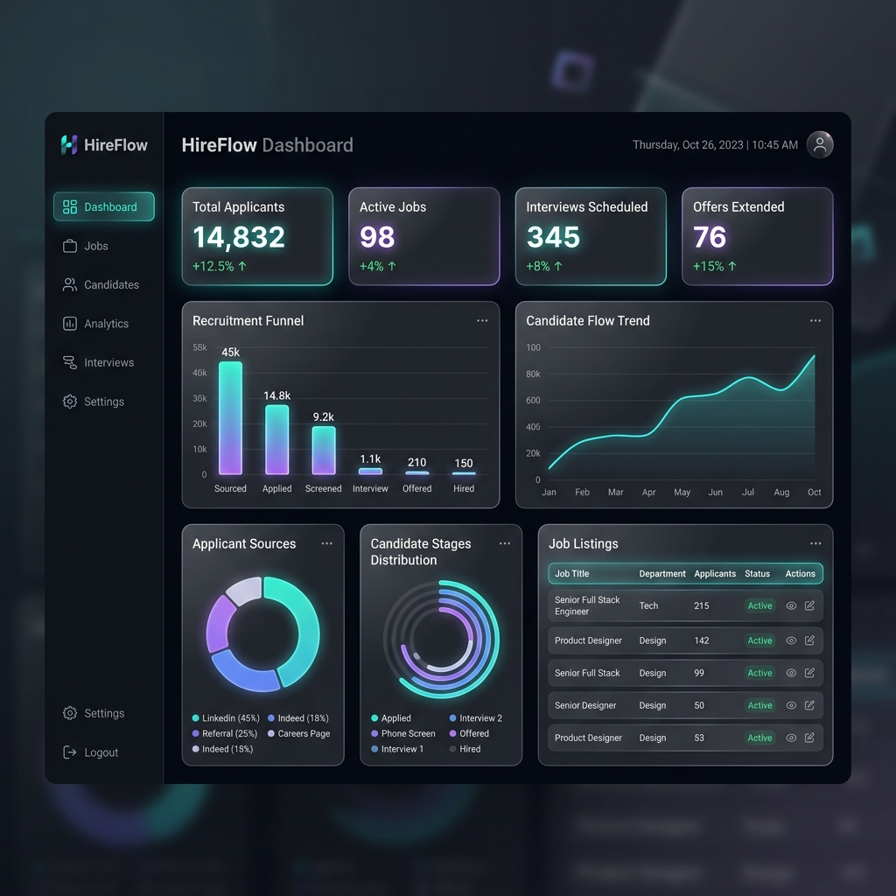
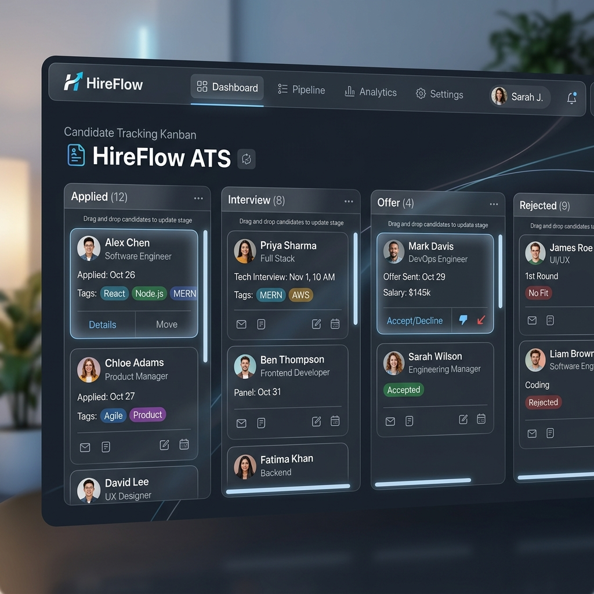

# HireFlow

HireFlow is a premium MERN stack Job Board and Applicant Tracking System (ATS) featuring a dark-first glassmorphic UI, real-time WebSocket notifications, role-based workflows (Candidates, Recruiters, Admins), and a drag-and-drop Kanban application pipeline.

---

## System Architecture



---

## Visual Previews

| Client Dashboard UI | Candidate Tracking Pipeline (Kanban) |
|:---:|:---:|
|  |  |

---

## Key Technical Implementations

* **Dark-First UI**: Custom-built Tailwind CSS theme utilizing glassmorphism backdrop-filters, custom scrollbars, and fluid transitions.
* **Authentication**: JWT-based access (15m) and refresh (7d) token scheme, secured with secure HTTP-only cookies and axios interceptors.
* **Kanban Board**: Drag-and-drop workflow powered by `@dnd-kit/core` to move applicants through recruitment stages (Applied, Screen, Interview, Offer, Rejected).
* **Real-time Notifications**: Bidirectional communications via Socket.io sending live alerts to applicants and recruiters on status updates.
* **State Management**: Zero global-state boilerplate; reads API transactions cleanly via TanStack Query (React Query) and forms through React Hook Form.

---

## Setup & Running Locally

### 1. Prerequisites
* **Node.js** (v18+)
* **MongoDB** (Running locally on default port `27017` or via Docker/Colima)

```bash
# Example to spin up Mongo locally using Docker
docker run -d -p 27017:27017 --name hireflow-mongo mongo:latest
```

### 2. Configure Environment Variables

Create `.env` files in both client and server directories:

**Server Configuration (`server/.env`):**
```env
PORT=5001
MONGO_URI=mongodb://127.0.0.1:27017/hireflow
JWT_ACCESS_SECRET=hireflow_dev_jwt_access_secret_token_string_64_characters_long_abcdef
JWT_REFRESH_SECRET=hireflow_dev_jwt_refresh_secret_token_string_64_characters_long_abcdef
JWT_ACCESS_EXPIRES=15m
JWT_REFRESH_EXPIRES=7d
CLOUDINARY_CLOUD_NAME=mock
CLOUDINARY_API_KEY=mock
CLOUDINARY_API_SECRET=mock
EMAIL_HOST=smtp.gmail.com
EMAIL_PORT=587
EMAIL_USER=mock@gmail.com
EMAIL_PASS=mock
CLIENT_URL=http://localhost:5173
NODE_ENV=development
```

**Client Configuration (`client/.env`):**
```env
VITE_API_URL=http://localhost:5001/api
VITE_SOCKET_URL=http://localhost:5001
```

### 3. Installation & Seeding

Install dependencies at the project root, client, and server, and seed the MongoDB database with initial sample mock data:

```bash
# From workspace root:
npm install
npm run seed
```

### 4. Running the Application

Launch both the Node backend and Vite frontend concurrently:

```bash
npm run dev
```
* **Frontend Portal**: http://localhost:5173
* **Backend REST API & WebSockets**: http://localhost:5001

---

## Credentials for Testing

Use the seeded database accounts to verify role-based permissions and user flows:

| Role | Username | Password | Purpose |
|---|---|---|---|
| **Administrator** | `admin@example.com` | `password123` | Approves pending recruiters |
| **Approved Recruiter** | `recruiter@example.com` | `password123` | Creates jobs, manages Kanban pipeline |
| **Pending Recruiter** | `pending@example.com` | `password123` | Demonstrates pending recruiter screen |
| **Candidate** | `candidate@example.com` | `password123` | Searches jobs, applies, views notifications |

---

## Future Targets & Enhancements

* [ ] **Cloudinary / Nodemailer Integration**: Replace mock upload/email utilities with active API keys to support physical resume PDFs and real email notifications.
* [ ] **Resume Parsing Service**: Integrate a PDF parser (e.g. `pdf-parse`) or AI extraction service to auto-fill applicant profiles upon upload.
* [ ] **Flexible Kanban Columns**: Allow recruiters to customize recruitment stages on a per-job basis.
* [ ] **Automated Testing Suite**: Implement frontend component testing using Jest / Vitest and end-to-end user path testing using Playwright.
